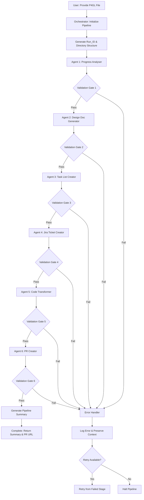
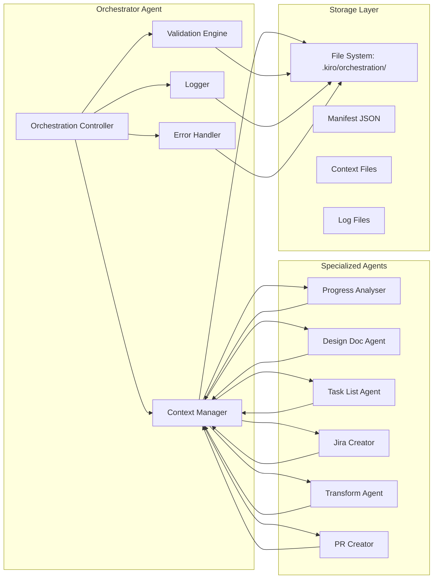
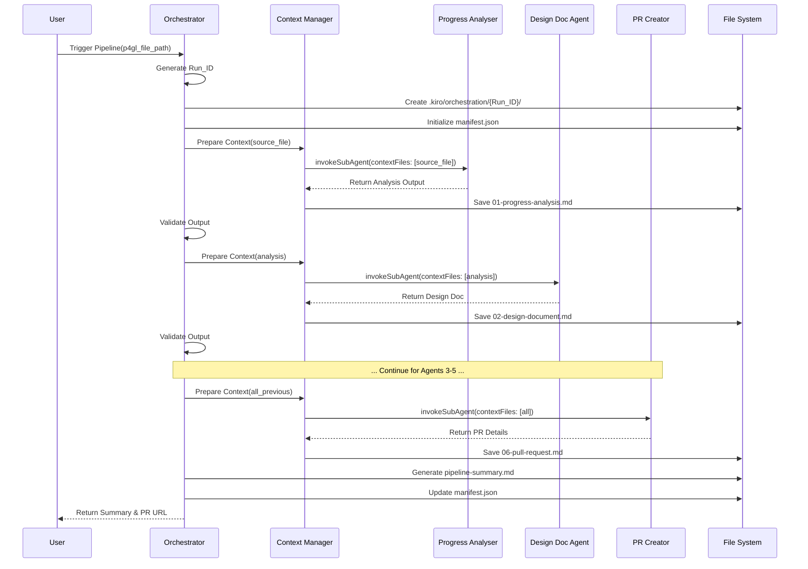
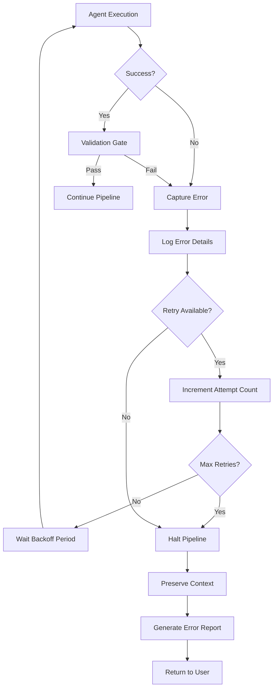

# Design Document: Agent Orchestration Workflow

## Executive Summary

The Agent Orchestration Workflow is an automation system that coordinates six specialized agents in a sequential pipeline to migrate Progress 4GL code to TypeScript. The orchestrator manages the complete end-to-end workflow from code analysis through GitHub pull request creation, handling context passing, error recovery, and progress tracking.

**Target Audience:** Developers performing Progress 4GL to TypeScript migrations, DevOps engineers managing migration pipelines, and system architects evaluating automation workflows.

**Primary Value Proposition:** Eliminates manual coordination overhead by automating the entire migration workflow, reducing a multi-day manual process to a single command execution with full traceability and error recovery capabilities.

## Overview

The orchestration system implements a sequential pipeline pattern where each agent's output becomes input context for subsequent agents. The system is built as a custom Kiro agent that leverages the `invokeSubAgent` capability to coordinate specialized agents while managing intermediate artifacts, validation gates, and error handling.

### Key Design Principles

1. **Sequential Execution with Context Enrichment**: Each agent receives cumulative context from all previous agents
2. **Fail-Fast with Recovery**: Validation gates between stages catch errors early; retry logic handles transient failures
3. **Complete Traceability**: All intermediate outputs, metadata, and execution logs are preserved for debugging and audit
4. **Idempotent Operations**: Pipeline stages can be re-run from any point using preserved context
5. **Configuration-Driven**: Behavior customizable through configuration files without code changes

## System Architecture

### High-Level Pipeline Flow



### Component Architecture



### Agent Execution Sequence



## Components and Interfaces

### 1. Orchestration Controller

**Responsibility:** Main coordination logic that manages pipeline execution flow, agent invocation sequencing, and overall workflow state.

**Key Methods:**
- `executePipeline(sourceFilePath: string): Promise<PipelineSummary>`
- `executeAgent(agentName: string, contextFiles: ContextFile[]): Promise<AgentOutput>`
- `validateAgentOutput(agentName: string, output: AgentOutput): ValidationResult`
- `handleAgentFailure(agentName: string, error: Error): Promise<void>`

**Dependencies:**
- Context Manager (for context file management)
- Validation Engine (for output validation)
- Error Handler (for failure recovery)
- Logger (for execution tracking)

### 2. Context Manager

**Responsibility:** Manages context file creation, storage, retrieval, and enrichment as context flows through the pipeline.

**Key Methods:**
- `createRunDirectory(runId: string): Promise<string>`
- `saveAgentOutput(agentName: string, output: string, runId: string): Promise<string>`
- `loadContextFiles(agentName: string, runId: string): Promise<ContextFile[]>`
- `enrichContext(newContext: ContextFile, existingContext: ContextFile[]): ContextFile[]`

**Context Enrichment Strategy:**
- Agent 1 (Progress Analyser): Receives source file only
- Agent 2 (Design Doc): Receives source file + analysis
- Agent 3 (Task List): Receives source file + analysis + design doc
- Agent 4 (Jira Creator): Receives all previous + task list
- Agent 5 (Transform): Receives all previous + Jira tickets
- Agent 6 (PR Creator): Receives all previous + transformed code

### 3. Validation Engine

**Responsibility:** Implements validation gates between pipeline stages to ensure output quality and completeness.

**Key Methods:**
- `validateProgressAnalysis(output: string): ValidationResult`
- `validateDesignDocument(output: string): ValidationResult`
- `validateTaskList(output: string): ValidationResult`
- `validateJiraTickets(output: string): ValidationResult`
- `validateTransformedCode(output: string): ValidationResult`
- `validatePullRequest(output: string): ValidationResult`

**Validation Rules:**
- **Progress Analysis**: Must contain sections for dependencies, data structures, procedural logic
- **Design Document**: Must contain at least one Mermaid diagram and all required sections
- **Task List**: Must contain all five task phases
- **Jira Tickets**: Must include Jira ticket IDs and URLs
- **Transformed Code**: TypeScript files must have no syntax errors
- **Pull Request**: Must include PR URL and branch name

### 4. Error Handler

**Responsibility:** Manages error capture, logging, retry logic, and graceful degradation.

**Key Methods:**
- `captureError(agentName: string, error: Error, runId: string): Promise<void>`
- `shouldRetry(agentName: string, attemptCount: number): boolean`
- `retryAgent(agentName: string, contextFiles: ContextFile[], attemptCount: number): Promise<AgentOutput>`
- `haltPipeline(reason: string, runId: string): Promise<void>`

**Retry Strategy:**
- Maximum 3 retry attempts per agent (configurable)
- Exponential backoff: 5s, 15s, 45s between retries
- Preserve all context files from successful agents
- Log each retry attempt with timestamp

### 5. Logger

**Responsibility:** Provides structured logging for debugging, audit trails, and progress tracking.

**Key Methods:**
- `logPipelineStart(runId: string, sourceFile: string): void`
- `logAgentStart(agentName: string, runId: string): void`
- `logAgentComplete(agentName: string, duration: number, runId: string): void`
- `logValidation(agentName: string, result: ValidationResult, runId: string): void`
- `logError(agentName: string, error: Error, runId: string): void`

**Log Levels:**
- INFO: Pipeline start/end, agent start/complete, validation success
- WARN: Validation warnings, retry attempts
- ERROR: Agent failures, validation failures, pipeline halt
- DEBUG: Context file operations, detailed agent parameters (when DEBUG_ORCHESTRATOR=true)

## Data Models

### Manifest Schema

```typescript
interface Manifest {
  runId: string;
  sourceFile: {
    path: string;
    contentHash: string;
  };
  startTime: string; // ISO 8601
  endTime?: string; // ISO 8601
  status: 'running' | 'completed' | 'failed';
  agents: AgentExecution[];
  contextFiles: Record<string, string>; // agentName -> filePath
  configuration: PipelineConfiguration;
  metadata: {
    kiroVersion: string;
    machineId: string;
    agentVersions: Record<string, string>;
  };
}

interface AgentExecution {
  name: string;
  status: 'pending' | 'running' | 'completed' | 'failed';
  startTime?: string;
  endTime?: string;
  duration?: number; // milliseconds
  attemptCount: number;
  outputFile?: string;
  errorFile?: string;
}
```

### Configuration Schema

```typescript
interface PipelineConfiguration {
  timeoutPerAgent: number; // milliseconds, default: 300000 (5 min)
  maxRetryAttempts: number; // default: 3
  outputDirectory: string; // default: '.kiro/orchestration'
  agentExecutionOrder: string[]; // default: standard 6-agent sequence
  agentParameters: Record<string, Record<string, any>>; // custom params per agent
  validationRules: {
    strictMode: boolean; // default: true
    requiredSections: Record<string, string[]>;
  };
}
```

### Context File Schema

```typescript
interface ContextFile {
  path: string; // relative to workspace root
  startLine?: number; // optional line range
  endLine?: number;
}

interface AgentOutput {
  content: string; // markdown content
  metadata: {
    agentName: string;
    executionTime: number;
    timestamp: string;
  };
  artifacts?: {
    files: string[]; // paths to generated files
    references: string[]; // external references (Jira IDs, PR URLs)
  };
}
```

### Pipeline Summary Schema

```typescript
interface PipelineSummary {
  runId: string;
  sourceFile: string;
  status: 'completed' | 'failed';
  totalDuration: number; // milliseconds
  agents: {
    name: string;
    status: string;
    duration: number;
    keyOutputs: string[];
  }[];
  artifacts: {
    analysisFile: string;
    designDocFile: string;
    taskListFile: string;
    jiraTickets: string[];
    transformedFiles: string[];
    pullRequest: {
      url: string;
      branch: string;
    };
  };
  contextFiles: string[];
}
```

## API Design / Interface

### Orchestrator Agent Configuration

**File:** `.kiro/agents/orchestrator-agent.json`

```json
{
  "name": "orchestrator-agent",
  "description": "Coordinates 6 specialized agents in a sequential pipeline for Progress 4GL to TypeScript migration",
  "prompt": "You are an Orchestration Specialist...",
  "welcomeMessage": "Ready to orchestrate the complete P4GL to TypeScript migration pipeline.",
  "tools": ["*"],
  "resources": [
    "file://.kiro/orchestration/config.json"
  ]
}
```

### Orchestrator Invocation Interface

**Command-Line Usage:**
```bash
# Full pipeline execution
kiro invoke orchestrator-agent --prompt "Migrate source-progress/code/progress/mfg/us/fa/fapl.p"

# Single agent execution
kiro invoke orchestrator-agent --prompt "Run only Design_Doc_Agent for Run_ID abc123"

# Retry from failure
kiro invoke orchestrator-agent --prompt "Retry pipeline from failed agent for Run_ID abc123"
```

**Programmatic Usage:**
```typescript
const result = await invokeSubAgent({
  name: 'orchestrator-agent',
  prompt: `Migrate ${sourceFilePath}`,
  contextFiles: [], // orchestrator manages its own context
  explanation: 'Triggering full migration pipeline'
});
```

### Agent Invocation Pattern

The orchestrator uses Kiro's `invokeSubAgent` capability:

```typescript
const agentOutput = await invokeSubAgent({
  name: agentName, // e.g., 'progress-code-analyser-agent'
  prompt: `Analyze the Progress 4GL file for migration`,
  contextFiles: [
    { path: sourceFilePath },
    { path: `.kiro/orchestration/${runId}/01-progress-analysis.md` }
  ],
  explanation: `Executing ${agentName} in pipeline stage ${stageNumber}`
});
```

## Infrastructure & DevOps

### Directory Structure

```
.kiro/
├── orchestration/
│   ├── config.json                    # Pipeline configuration
│   ├── {Run_ID_1}/
│   │   ├── manifest.json              # Run metadata
│   │   ├── 01-progress-analysis.md    # Agent 1 output
│   │   ├── 02-design-document.md      # Agent 2 output
│   │   ├── 03-task-list.md            # Agent 3 output
│   │   ├── 04-jira-tickets.md         # Agent 4 output
│   │   ├── 05-transformation-summary.md # Agent 5 output
│   │   ├── 06-pull-request.md         # Agent 6 output
│   │   ├── pipeline-summary.md        # Final summary
│   │   ├── progress.log               # Progress tracking
│   │   ├── debug.log                  # Detailed debug logs
│   │   └── error-{agent-name}.log     # Error logs (if failures)
│   ├── {Run_ID_2}/
│   │   └── ...
│   └── ...
├── agents/
│   ├── orchestrator-agent.json        # Orchestrator configuration
│   ├── progress-code-analyser-agent.json
│   ├── design-doc-agent.json
│   ├── task-list-agent.json
│   ├── jira-ticket-creator-agent.json
│   ├── p4gl-to-ts-transform-agent.json
│   └── pr-creator-agent.json
└── steering/
    ├── progress-code-analysis.md
    ├── design-doc-rules.md
    ├── task_list_rules.md
    ├── jira-ticket-standards.md
    ├── p4gl-to-ts-rules.md
    └── pr-standards.md
```

### Run ID Generation

```typescript
function generateRunId(): string {
  const timestamp = new Date().toISOString().replace(/[:.]/g, '-').slice(0, 19);
  const randomId = Math.random().toString(36).substring(2, 8);
  return `${timestamp}_${randomId}`;
}
// Example: "2024-01-15T10-30-45_a7x9k2"
```

### File Retention Policy

- **Active Runs**: Preserved indefinitely until manually deleted
- **Completed Runs**: Preserved for minimum 30 days
- **Failed Runs**: Preserved indefinitely for debugging
- **Cleanup**: Manual cleanup via `kiro orchestration clean --older-than 30d`

### Deployment Strategy

The orchestrator is deployed as a Kiro agent configuration file, requiring no separate deployment. Dependencies:

1. **Kiro Runtime**: Version 1.0.0+
2. **Specialized Agents**: All 6 agents must be configured in `.kiro/agents/`
3. **Steering Files**: All steering files must exist in `.kiro/steering/`
4. **External Services**: 
   - GitHub API access (for PR Creator)
   - Jira API access (for Jira Creator)

### CI/CD Integration

The orchestrator can be integrated into CI/CD pipelines:

```yaml
# Example GitHub Actions workflow
name: P4GL Migration Pipeline
on:
  workflow_dispatch:
    inputs:
      source_file:
        description: 'Path to Progress 4GL file'
        required: true

jobs:
  migrate:
    runs-on: ubuntu-latest
    steps:
      - uses: actions/checkout@v3
      - name: Run Migration Pipeline
        run: |
          kiro invoke orchestrator-agent --prompt "Migrate ${{ github.event.inputs.source_file }}"
      - name: Upload Artifacts
        uses: actions/upload-artifact@v3
        with:
          name: migration-artifacts
          path: .kiro/orchestration/
```

## Error Handling

### Error Categories

1. **Validation Errors**: Agent output doesn't meet quality gates
2. **Agent Execution Errors**: Agent fails during execution
3. **File System Errors**: Cannot read/write context files
4. **Configuration Errors**: Invalid configuration schema
5. **Timeout Errors**: Agent exceeds configured timeout

### Error Handling Strategy



### Error Logging Format

```typescript
interface ErrorLog {
  timestamp: string;
  runId: string;
  agentName: string;
  errorType: string;
  message: string;
  stackTrace: string;
  attemptCount: number;
  contextFiles: string[];
  agentParameters: Record<string, any>;
}
```

### Recovery Mechanisms

1. **Automatic Retry**: Up to 3 attempts with exponential backoff
2. **Manual Retry**: User can retry from failed stage using preserved context
3. **Partial Recovery**: User can skip failed agent and continue (with warnings)
4. **Full Restart**: User can restart entire pipeline with same or modified inputs

## Testing Strategy

### Unit Testing

**Focus Areas:**
- Run ID generation logic
- Context file path resolution
- Validation rule implementations
- Error categorization logic
- Configuration schema validation

**Example Tests:**
```typescript
describe('Orchestration Controller', () => {
  test('should generate unique Run_ID with timestamp and random component', () => {
    const runId1 = generateRunId();
    const runId2 = generateRunId();
    expect(runId1).not.toEqual(runId2);
    expect(runId1).toMatch(/^\d{4}-\d{2}-\d{2}T\d{2}-\d{2}-\d{2}_[a-z0-9]{6}$/);
  });

  test('should validate Progress Analysis output contains required sections', () => {
    const validOutput = `
      ## Dependencies
      ...
      ## Data Structures
      ...
      ## Procedural Logic
      ...
    `;
    const result = validateProgressAnalysis(validOutput);
    expect(result.isValid).toBe(true);
  });

  test('should reject Design Document without Mermaid diagrams', () => {
    const invalidOutput = `# Design Doc\n\nNo diagrams here`;
    const result = validateDesignDocument(invalidOutput);
    expect(result.isValid).toBe(false);
    expect(result.errors).toContain('Missing Mermaid diagram');
  });
});
```

### Integration Testing

**Focus Areas:**
- Agent invocation via `invokeSubAgent`
- Context file creation and retrieval
- End-to-end pipeline execution with mock agents
- Error handling and retry logic
- Manifest file generation

**Example Tests:**
```typescript
describe('Pipeline Integration', () => {
  test('should execute full pipeline with mock agents', async () => {
    const mockAgents = setupMockAgents();
    const result = await executePipeline('test-file.p');
    
    expect(result.status).toBe('completed');
    expect(result.agents).toHaveLength(6);
    expect(mockAgents.progressAnalyser).toHaveBeenCalledTimes(1);
    expect(mockAgents.prCreator).toHaveBeenCalledTimes(1);
  });

  test('should retry failed agent up to 3 times', async () => {
    const mockAgent = jest.fn()
      .mockRejectedValueOnce(new Error('Transient failure'))
      .mockRejectedValueOnce(new Error('Transient failure'))
      .mockResolvedValueOnce({ content: 'Success' });
    
    const result = await executeAgentWithRetry('test-agent', [], mockAgent);
    
    expect(mockAgent).toHaveBeenCalledTimes(3);
    expect(result.content).toBe('Success');
  });
});
```

### End-to-End Testing

**Focus Areas:**
- Complete pipeline execution with real agents (in test environment)
- Context enrichment across all stages
- File system operations and cleanup
- Error recovery scenarios
- Configuration override behavior

**Test Scenarios:**
1. **Happy Path**: All agents succeed, PR created successfully
2. **Validation Failure**: Design doc missing diagram, pipeline halts
3. **Agent Failure with Retry**: Transform agent fails twice, succeeds on third attempt
4. **Persistent Failure**: Jira creator fails 3 times, pipeline halts with preserved context
5. **Manual Retry**: User retries from failed stage using preserved Run_ID
6. **Custom Configuration**: Pipeline uses custom timeout and agent order

### Smoke Testing

**Focus Areas:**
- Orchestrator agent loads successfully
- Configuration file parsing
- Directory structure creation
- Logging initialization

**Example Tests:**
```typescript
describe('Orchestrator Smoke Tests', () => {
  test('should load orchestrator agent configuration', () => {
    const config = loadAgentConfig('orchestrator-agent');
    expect(config.name).toBe('orchestrator-agent');
    expect(config.tools).toContain('*');
  });

  test('should create run directory structure', async () => {
    const runId = generateRunId();
    await createRunDirectory(runId);
    
    expect(fs.existsSync(`.kiro/orchestration/${runId}`)).toBe(true);
    expect(fs.existsSync(`.kiro/orchestration/${runId}/manifest.json`)).toBe(true);
  });
});
```

### Mock-Based Testing

For testing orchestrator logic without invoking real agents:

```typescript
// Mock agent responses
const mockAgentResponses = {
  'progress-code-analyser-agent': {
    content: '## Dependencies\n...\n## Data Structures\n...',
    metadata: { agentName: 'progress-code-analyser-agent', executionTime: 5000 }
  },
  'design-doc-agent': {
    content: '# Design\n```mermaid\ngraph TD\n...\n```',
    metadata: { agentName: 'design-doc-agent', executionTime: 8000 }
  }
  // ... other agents
};

// Mock invokeSubAgent
jest.mock('kiro-sdk', () => ({
  invokeSubAgent: jest.fn((params) => {
    return Promise.resolve(mockAgentResponses[params.name]);
  })
}));
```

## Security & Compliance

### Authentication & Authorization

- **GitHub Access**: PR Creator requires GitHub Personal Access Token with `repo` scope
- **Jira Access**: Jira Creator requires Atlassian API token with project write permissions
- **File System Access**: Orchestrator requires read/write access to `.kiro/orchestration/` directory

**Token Management:**
- Tokens stored in agent configuration files (`.kiro/agents/*.json`)
- Tokens loaded from environment variables in production
- Never log tokens in debug logs or error messages

### Data Privacy

**Sensitive Data Handling:**
- Source code content may contain proprietary business logic
- Context files stored locally, never transmitted to external services except GitHub/Jira
- Manifest files do not contain source code, only metadata and file paths

**Data Retention:**
- Context files preserved for minimum 30 days
- Users responsible for manual cleanup of sensitive data
- No automatic transmission of pipeline data to external analytics

### Input Validation

**Source File Validation:**
- Verify file exists and is readable
- Check file extension matches expected Progress 4GL extensions (.p, .w, .cls, .i)
- Validate file size within reasonable limits (< 10MB)

**Configuration Validation:**
- Validate configuration schema against JSON Schema
- Reject invalid timeout values (< 0 or > 1 hour)
- Validate agent execution order contains all required agents

### Error Message Sanitization

- Error messages must not expose file system paths outside workspace
- Stack traces sanitized to remove absolute paths
- API tokens redacted from all logs and error messages

## Open Questions

1. **Concurrent Pipeline Execution**: Should the orchestrator support running multiple pipelines concurrently for different source files? Current design assumes sequential execution.

2. **Agent Version Compatibility**: How should the orchestrator handle version mismatches between specialized agents? Should it enforce minimum versions?

3. **Partial Pipeline Execution**: Should users be able to execute only a subset of agents (e.g., Analysis + Design only)? Current design supports single agent execution but not arbitrary subsets.

4. **Context File Size Limits**: What is the maximum size for context files passed to agents? Large design documents or analysis outputs could exceed token limits.

5. **Pipeline Branching**: Should the orchestrator support conditional branching (e.g., skip Jira creation if tickets already exist)? Current design is strictly sequential.

6. **Rollback Mechanism**: Should the orchestrator support rolling back changes (e.g., deleting created PR, closing Jira tickets) if later stages fail?

7. **Notification System**: Should the orchestrator send notifications (email, Slack) on pipeline completion or failure? Current design only logs to console and files.

8. **Resource Limits**: Should the orchestrator enforce memory or CPU limits on agent execution to prevent resource exhaustion?

9. **Audit Trail**: Should the orchestrator maintain a centralized audit log across all pipeline runs for compliance purposes?

10. **Agent Health Checks**: Should the orchestrator perform health checks on specialized agents before starting the pipeline to fail fast if agents are misconfigured?
