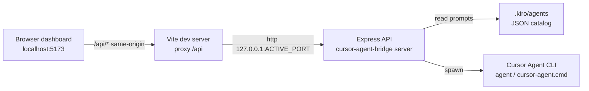
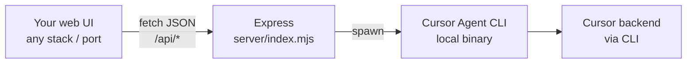

# Cursor Agent Bridge — Workflow, Ports, Agent Resolution, UI Layout

This document describes how the bridge UI talks to the Express API, how ports stay in sync, where agents are loaded from, and which folders matter for development.

---

## High-level architecture



- **UI**: React app under `cursor-agent-bridge/src/`, bundled by Vite.
- **API**: Node/Express in `cursor-agent-bridge/server/index.mjs`.
- **Agent definitions**: `*.json` under `<catalogRoot>/.kiro/agents` (catalog root defaults to the repo parent of `cursor-agent-bridge`).
- **CLI run folder**: `agent --workspace` uses the “target workspace” (UI field / env), which may differ from the catalog root.

---

## UI-focused folder (`cursor-agent-bridge/`)

| Path | Role |
|------|------|
| `src/main.tsx` | React entry; mounts `App` (dashboard). |
| `src/App.tsx` | Dashboard: health, agents, models, run; uses `readApiJson` + `apiUrl`. |
| `src/apiUrl.ts` | Optional `VITE_API_URL`; otherwise relative `/api/...` (Vite proxy). |
| `src/index.css` | Global styles. |
| `vite.config.ts` | Dev/preview server; dynamic `/api` proxy to bridge port. |
| `server/index.mjs` | Express API, agent catalog resolution, CLI spawn. |
| `.env` / `.env.example` | `AGENT_BRIDGE_PORT`, optional `VITE_API_URL`. |
| `agent.config.json` | Optional default `agentBin` path (server-side). |
| `.dev-api-port` | **Ephemeral** — written when API listens; Vite reads it per request. Gitignored. |

**Repo root** (sibling of `cursor-agent-bridge/`): typically holds `.kiro/agents` and `.kiro/steering` used as the catalog unless overridden by env.

---

## Connecting a different web UI (“Agents AI”) to Cursor

There is **no separate npm package** that talks to Cursor from the browser. Connectivity is:

1. **Your UI** → **HTTP + JSON** → **`cursor-agent-bridge` Express server** (`server/index.mjs`).
2. **The bridge** → **subprocess** → **Cursor Agent CLI** (`agent`, `cursor-agent.cmd`, etc.) on the same machine.
3. The CLI → **Cursor cloud / account** (auth, models), as documented by Cursor.



### Files that define “connectivity”

| Role | File(s) | Notes |
|------|---------|--------|
| **API server (required)** | `server/index.mjs` | All routes, CORS, CLI spawn, catalog/workspace resolution. This is the only process that runs `agent`. |
| **Bundled React UI helpers** | `src/apiUrl.ts`, `src/App.tsx` | Optional patterns: base URL + `fetch`. **Not required** if you use another UI—copy the URL logic only. |
| **Dev-only proxy for bundled UI** | `vite.config.ts` | Proxies `/api` → bridge port when you run Vite. **Your separate UI** usually skips this and calls the bridge URL directly. |
| **Runtime port hint** | `.dev-api-port` (gitignored) | Written by the server when it listens; used by Vite proxy. External UIs should use **`GET /api/ping`** → `apiPort` instead. |
| **Env / config** | `.env`, `.env.example`, `agent.config.json` | Ports, optional `CURSOR_AGENT_BIN`, catalog roots—not “SDK” files, just configuration the server reads. |

### Dependency files (`package.json`)

**Bridge package** (`cursor-agent-bridge/package.json`):

| Kind | Packages | Purpose |
|------|-----------|---------|
| **Runtime (server)** | `express`, `cors` | HTTP API + browser CORS for local dev origins. |
| **Dev / bundled UI** | `vite`, `@vitejs/plugin-react`, `react`, `react-dom`, `typescript`, `concurrently` | Only needed if you build or run the stock dashboard from this repo. |

**Your own Agents AI UI** does not need to add `express` or this repo as a library. It only needs a way to call `http://127.0.0.1:<AGENT_BRIDGE_PORT>/api/...` (or whatever host/port the bridge logs). Use `fetch`, axios, or your framework’s HTTP client.

### How your UI should connect

1. **Start the bridge API** (with or without the bundled Vite UI):
   - `npm run dev:server --prefix cursor-agent-bridge`, or
   - `npm run dev` for server + stock UI.
2. **Discover the port** (important if the preferred port was busy):
   - `GET http://127.0.0.1:<preferred>/api/ping` → JSON includes `apiPort`.
3. **Set a base URL** in your app, e.g. `AGENT_API_BASE=http://127.0.0.1:3848` (match `apiPort`).
4. **Call the JSON API** (all from the same origin as your UI **or** enable CORS—bridge already allows `http://localhost:*` and `http://127.0.0.1:*`). If you host the UI on another hostname, extend `cors` in `server/index.mjs`.
5. **Optional query `agentBin`**: health, models, agent-modes, and run accept `agentBin` so the user’s CLI path can be passed per request (same as the bundled UI).

### REST surface (contract for any UI)

| Method | Path | Purpose |
|--------|------|--------|
| `GET` | `/api/ping` | Liveness + **`apiPort`** (actual listen port). |
| `GET` | `/api/health?agentBin=...` | Catalog paths, default workspace, CLI probe. |
| `GET` | `/api/agents` | List Kiro agents from `.kiro/agents`. |
| `GET` | `/api/models?workspaceRoot=&agentBin=` | Models from CLI. |
| `GET` | `/api/agent-modes?workspaceRoot=&agentBin=` | Modes parsed from `agent --help`. |
| `POST` | `/api/run` | Body: `agentName`, `userMessage`, `outputFormat`, `workspaceRoot`, `model`, `executionMode`, `agentBin`. Use `agentName: "__user_prompt_only__"` for prompt-only runs. |

Responses are JSON; errors may be HTTP 4xx/5xx with `{ error: "..." }` or business `{ ok: false, ... }` depending on the route.

### Optional: tiny client module in your repo

You can mirror `src/apiUrl.ts` in your project:

```typescript
// Pseudocode for your Agents AI app
const BASE = import.meta.env.VITE_AGENT_API?.replace(/\/$/, '') ?? 'http://127.0.0.1:3847';

export function agentApi(path: string) {
  const p = path.startsWith('/') ? path : `/${path}`;
  return `${BASE}${p}`;
}
```

Point `VITE_AGENT_API` at the bridge **after** reading `apiPort` from `/api/ping` if you use dynamic ports.

---

## Port coordination (important code)

### 1. Server: load `.env`, preferred port, active port, port file

The server loads `cursor-agent-bridge/.env` early, picks `PREFERRED_PORT`, clears stale `.dev-api-port`, then on successful listen writes the **actual** `ACTIVE_PORT` (may differ if ports are busy).

```javascript
// server/index.mjs (excerpt)
const PREFERRED_PORT = Number(process.env.AGENT_BRIDGE_PORT || 3847);
let ACTIVE_PORT = PREFERRED_PORT;
const DEV_API_PORT_FILE = path.join(BRIDGE_ROOT, '.dev-api-port');

clearDevApiPortFile(); // before listen — avoid stale proxy target

// GET /api/ping returns the live port
app.get('/api/ping', (_req, res) => {
  res.json({ ok: true, service: 'cursor-agent-bridge', apiPort: ACTIVE_PORT });
});

function startHttpServerWithFallback(startPort, maxAttempts = 20) {
  const tryPort = (port, attemptsLeft) => {
    ACTIVE_PORT = port;
    const httpServer = app.listen(port, HOST, () => {
      writeFileSync(DEV_API_PORT_FILE, `${ACTIVE_PORT}\n`, 'utf8');
      // logs [cursor-agent-bridge] http://HOST:ACTIVE_PORT ...
    });
    httpServer.on('error', (err) => {
      if (err.code === 'EADDRINUSE' && attemptsLeft > 0) {
        tryPort(port + 1, attemptsLeft - 1);
        return;
      }
      process.exit(1);
    });
  };
  tryPort(startPort, maxAttempts);
}

startHttpServerWithFallback(PREFERRED_PORT);
```

On shutdown, handlers remove `.dev-api-port` so the next run does not proxy to a dead process.

### 2. Vite: per-request proxy (never a stale fixed target)

Vite resolves the bridge port **on each `/api` request**: first `.dev-api-port`, then `AGENT_BRIDGE_PORT` from env / `loadEnv`.

```typescript
// vite.config.ts (excerpt)
function readBridgePort(mode: string): string {
  const portFile = path.join(__dirname, '.dev-api-port');
  if (existsSync(portFile)) {
    const n = readFileSync(portFile, 'utf8').trim();
    if (/^\d+$/.test(n)) return n;
  }
  const env = loadEnv(mode, __dirname, '');
  return env.AGENT_BRIDGE_PORT || process.env.AGENT_BRIDGE_PORT || '3847';
}

// middleware: for req.url starting with /api → http.request to 127.0.0.1:readBridgePort(mode)
```

### 3. UI: `VITE_API_URL` vs same-origin proxy

```typescript
// src/apiUrl.ts
export function apiUrl(path: string): string {
  const base = (import.meta.env.VITE_API_URL as string | undefined)?.replace(/\/$/, '').trim() ?? '';
  const p = path.startsWith('/') ? path : `/${path}`;
  if (base) return `${base}${p}`;
  return p;
}
```

If `VITE_API_URL` is wrong, `readApiJson` in `App.tsx` retries the relative path so Vite’s proxy can still reach the API.

---

## Agent “pointing” — catalog vs run workspace vs binary

### Catalog root (where `.kiro/agents` is read)

```javascript
// server/index.mjs
function getAgentCatalogRoot() {
  const fromEnv =
    process.env.AGENT_CATALOG_ROOT?.trim() || process.env.KIRO_AGENT_CATALOG_ROOT?.trim();
  if (fromEnv) return path.resolve(fromEnv);
  return DEFAULT_WORKSPACE; // parent of cursor-agent-bridge
}
```

### Run workspace (`agent --workspace`)

Resolution order: request body → `TARGET_WORKSPACE` → `WORKSPACE_ROOT` → catalog root.

```javascript
function resolveRunWorkspace(fromBody) {
  const b = typeof fromBody === 'string' && fromBody.trim() ? path.resolve(fromBody.trim()) : '';
  if (b) return b;
  const t = process.env.TARGET_WORKSPACE?.trim();
  if (t) return path.resolve(t);
  const w = process.env.WORKSPACE_ROOT?.trim();
  if (w) return path.resolve(w);
  return getAgentCatalogRoot();
}
```

### Agent executable resolution

Order: `CURSOR_AGENT_BIN` → `agent.config.json` `agentBin` → `where agent` / PATH → `'agent'`.

UI can override per request via `agentBin` query/body; server uses `resolveEffectiveAgentBin(override)`.

### Example: `/api/run` uses both roots

```javascript
// server/index.mjs (POST /api/run — simplified)
const runWorkspace = resolveRunWorkspace(req.body?.workspaceRoot ?? '');
const agentCatalogRoot = getAgentCatalogRoot();
// If agentName === '__user_prompt_only__', combinedPrompt = userMessage only; else build from catalog.
const result = await runCursorAgent({
  workspaceRoot: runWorkspace,
  combinedPrompt,
  outputFormat,
  model,
  executionMode,
  agentBin: agentBinRaw,
});
```

---

## Environment quick reference

| Variable | Where | Purpose |
|----------|--------|---------|
| `AGENT_BRIDGE_PORT` | `cursor-agent-bridge/.env` | Preferred API port (3847 default; server may bump if busy). |
| `AGENT_BRIDGE_HOST` | optional | Bind host (default `127.0.0.1`). |
| `VITE_API_URL` | optional in `.env` | Direct API base; if set wrong, UI may break unless fallback path works. |
| `AGENT_CATALOG_ROOT` / `KIRO_AGENT_CATALOG_ROOT` | optional | Override folder containing `.kiro/agents`. |
| `TARGET_WORKSPACE` / `WORKSPACE_ROOT` | optional | Default run workspace for CLI. |
| `CURSOR_AGENT_BIN` | optional | Global override for CLI path. |

Copy `.env.example` → `.env` in `cursor-agent-bridge/` and align `AGENT_BRIDGE_PORT` with what the server logs.

---

## UI client resilience (`readApiJson`)

```typescript
// src/App.tsx (excerpt)
async function readApiJson<T>(path: string, init?: RequestInit): Promise<T> {
  const normalizedPath = normalizeApiPath(path);
  const primaryUrl = apiUrl(normalizedPath);
  // ... fetch primaryUrl, parse JSON ...
  // if primaryUrl !== normalizedPath and parse fails, retry fetch(normalizedPath) for Vite proxy
}
```

---

## Methods used (summary)

1. **Separate catalog and run workspace** so prompts stay in-repo while edits target any folder.
2. **Single ephemeral port hint** (`.dev-api-port`) + **per-request Vite proxy** so UI and API never drift after restarts or port conflicts.
3. **Port fallback on `EADDRINUSE`** so a busy default port does not brick the stack.
4. **Defensive API client** (timeouts, non-JSON detection, same-origin fallback).
5. **Configurable CLI path** (env, config file, UI override) with Windows-friendly shell spawn for `.cmd`.

---

## Related files

- `package.json` (repo root): `agent-ui` → `npm run dev --prefix cursor-agent-bridge`
- `cursor-agent-bridge/package.json`: `dev` runs `concurrently` server + Vite
